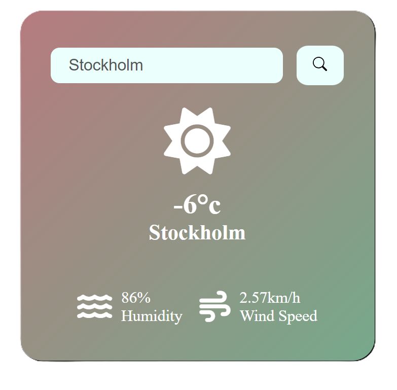

# Weather App

The Weather App is developed using HTML, CSS, and JavaScript. It is a fully functional app that allows users to input a city name and provides the current weather conditions in response.

## Installation

No installation needed. Just put files in a folder and open index.htm file in a browser

## License

Freeware

## Screenshot
Here’s a glimpse of the Weather App interface:

